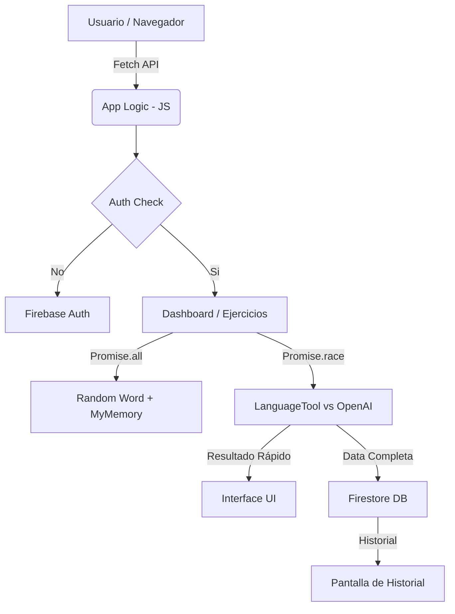

# Documentación del Proyecto: ENGLISH

## 1. Definición del Problema
Aprender un nuevo idioma requiere práctica constante y corrección inmediata. Muchos estudiantes escriben frases en inglés sin saber si son gramaticalmente correctas o por qué se cometió un error. Existe la necesidad de una herramienta centralizada que no solo corrija, sino que explique y guarde el progreso del estudiante de forma atractiva.

## 2. Objetivos
*   **Corregir**: Utilizar algoritmos de procesamiento de lenguaje natural para identificar errores gramaticales.
*   **Explicar**: Aprovechar la IA para dar contexto pedagógico a los errores detectados.
*   **Motivar**: Ofrecer una interface moderna (Google Stitch UI) y una "palabra del día" para fomentar el hábito diario.
*   **Persistir**: Guardar el historial de aprendizaje para que el usuario pueda repasar sus errores pasados.

## 3. Selección de APIs (Mashup)
La potencia de esta aplicación reside en la integración de 5 servicios distintos:

| API | Función en el Proyecto |
| :--- | :--- |
| **OpenAI** | Genera explicaciones detalladas y ejemplos de uso pedagógico. |
| **LanguageTool** | Proporciona corrección técnica inmediata de gramática y ortografía. |
| **Random Word** | Suministra la palabra del día para el dashboard inicial. |
| **MyMemory** | Realiza traducciones bidireccionales rápidas entre inglés y español. |
| **Firebase** | Gestiona la autenticación de usuarios y la base de datos Firestore. |

## 4. Arquitectura del Sistema
El siguiente diagrama muestra cómo interactúan los componentes:

## 5. Implementación de Promesas (Requisito Técnico)

### Promise.all()
Se utiliza en el Dashboard para cargar la "Palabra del día". Al obtener la palabra aleatoria, lanzamos en paralelo la petición de traducción. Esto reduce el tiempo de espera total al no ejecutar las peticiones de forma secuencial.
*   *Ubicación:* `js/api.js` -> `getRandomWordWithTranslation()`

### Promise.race()
Se utiliza en la corrección de ejercicios. Dado que OpenAI puede tardar más que LanguageTool, competimos entre ambas. La interface indica quién respondió más rápido (`LanguageTool` suele ganar por milisegundos), permitiendo mostrar información al usuario lo antes posible.
*   *Ubicación:* `js/api.js` -> `getFastestResponse()`

## 6. Interfaz de Usuario (Stitch AI)
La interfaz se ha diseñado siguiendo las guías de **Google Stitch**:
- **Bordes redondeados**: 16px para tarjetas y botones.
- **Navegación**: Menú inferior fijo para fácil acceso desde dispositivos móviles.
- **Jerarquía**: Uso de sombras suaves (`box-shadow`) para separar capas de información.
- **Paleta**: Verde esmeralda (#10b981) para éxito/aprendizaje y Azul real (#2563eb) para acciones principales.

## 7. Capturas de la Interfaz

### Dashboard (Inicio)

### Pantalla de Ejercicios y Corrección

---
**Proyecto desarrollado para el curso de Desarrollo Web Mashup - Asistente ENGLISH.**
