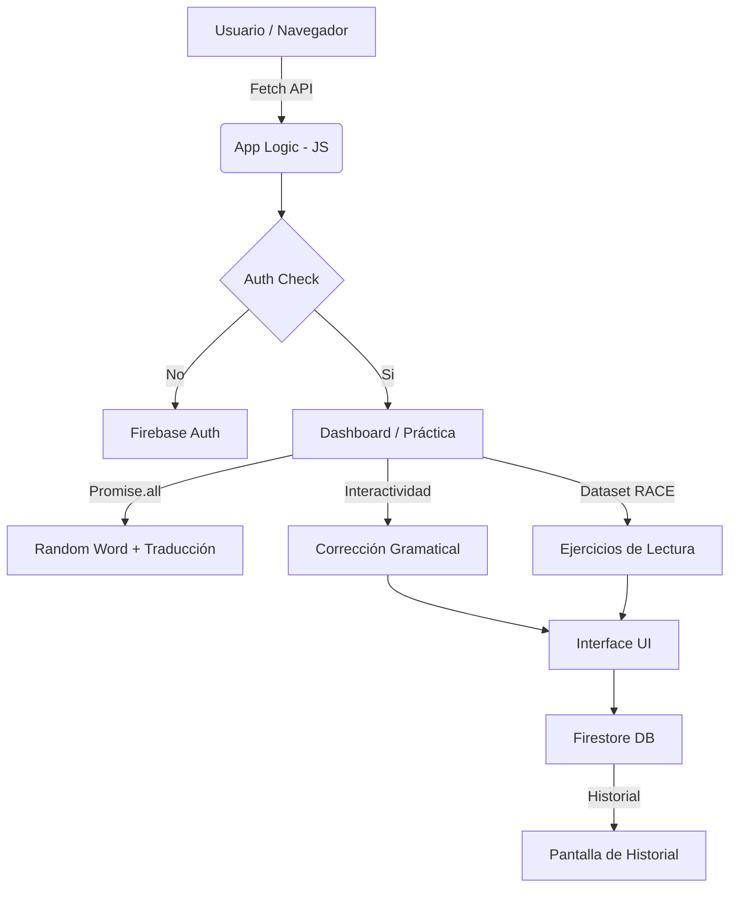

# Documentación del Proyecto: ENGLISH

## 1. Definición del Problema
Aprender un nuevo idioma requiere práctica constante y corrección inmediata. Muchos estudiantes escriben frases en inglés sin saber si son gramaticalmente correctas o por qué se cometió un error. Existe la necesidad de una herramienta centralizada que no solo corrija, sino que proporcione ejercicios estructurados y guarde el progreso del estudiante de forma atractiva.

## 2. Objetivos
*   **Corregir**: Utilizar algoritmos de procesamiento de lenguaje natural para identificar errores gramaticales en tiempo real.
*   **Ejercitar**: Ofrecer una sección de comprensión de lectura basada en el dataset RACE para mejorar la fluidez lectora.
*   **Motivar**: Ofrecer una interfaz moderna y una "palabra del día" para fomentar el hábito diario.
*   **Persistir**: Guardar el historial de aprendizaje para que el usuario pueda repasar sus errores pasados.

## 3. Selección de APIs (Mashup)
La potencia de esta aplicación reside en la integración de servicios especializados:

| API | Función en el Proyecto |
| :--- | :--- |
| **LanguageTool** | Proporciona corrección técnica inmediata de gramática y ortografía. |
| **Datamuse** | Suministra la palabra del día para el dashboard inicial. |
| **MyMemory** | Realiza traducciones bidireccionales rápidas entre inglés y español. |
| **Firebase** | Gestiona la autenticación de usuarios y la base de datos Firestore. |

## 4. Arquitectura del Sistema
El siguiente diagrama muestra cómo interactúan los componentes:

## 5. Implementación de Promesas (Requisito Técnico)

### Promise.all()
Se utiliza en el Dashboard para cargar la "Palabra del día". Al obtener la palabra aleatoria desde la API de Datamuse, lanzamos en paralelo la petición de traducción a MyMemory. Esto optimiza el tiempo de carga al no esperar a que termine una para empezar la otra.
*   *Ubicación:* `js/api/index.js` -> `getRandomWordWithTranslation()`

## 6. Curriculo y Contenido Estático
La aplicación cuenta con un temario completo desde el nivel A1 hasta el C2. Para garantizar la disponibilidad y fiabilidad del contenido, las lecciones se cargan desde un sistema de contenido estático modularizado (`js/content/`), lo que permite un acceso instantáneo y sin dependencia de APIs generativas de terceros.

## 7. Interfaz de Usuario
La interfaz se ha diseñado siguiendo principios modernos de diseño:
- **Bordes redondeados**: Estilo premium para tarjetas y botones.
- **Navegación**: Menú inferior fijo para fácil acceso desde dispositivos móviles.
- **Jerarquía**: Uso de sombras suaves y gradientes para una experiencia inmersiva.
- **Paleta**: Colores vibrantes y modo oscuro para reducir la fatiga visual.

---
**Proyecto de Aprendizaje de Inglés - Plataforma Interactiva.**
